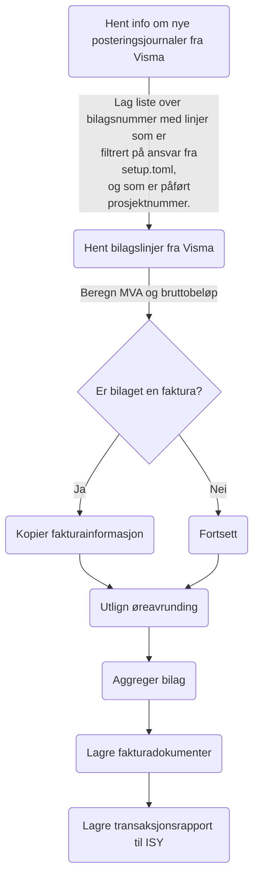

# Integrasjon fra Visma Enterprise Økonomisystem til ISY ProsjektØkonomi
 [](https://github.com/astral-sh/ruff)  

## Hvorfor?
Visma har en standard-integrasjon for å overføre transaksjons-informasjon til ISY. Denne detaljerer hver regnskapslinje.

Vi er imidlertid interessert i en integrasjon som aggregerer linjene. Hovedinformasjonen vi er interessert i å få over til ISY er bilagsnummer, ansvar, prosjekt, faktura og beløp. Hvordan fakturaen er splittet for å legge til rette for ulik behandling av MVA osv. er ikke like interessant for oss, og å få over denne informasjonen til ISY vil, etter vår vurdering, kunne skape mer etterarbeid.

## Hvordan?
Programmet settes opp til å kjøre jevnlig, eksempelvis hvert 5. minutt.

Programmet søker etter nye, posterte journalnummer i Visma for hvert selskap det er stilt inn til å søke igjennom.

Programmet søker så opp alle bilagsnummer som har rett kombinasjon av ansvar og prosjekt.

Programmet henter så inn bilagslinjene, bearbeider og eksporterer resultatet til et format som kan importeres av ISY Prosjektøkonomi.



## Kom i gang
```console
git clone https://github.com/stavangerkommune/ve-til-isy
cd ve-til-isy
python -m venv .venv
.venv\script\activate
python -m pip install -r requirements.lock
python -m src.ve_til_isy
```

## Docker
Det enkleste er å starte hente docker-image fra Docker Hub, og bruke en env-fil.

.env.dist er en grei mal på hva som trengs i env-filen.

```console
docker run --env-file env --name ve_til_isy sk29433/ve-til-isy
```

## Innstillinger
Scriptet bruker environment variables. Se ".env.dist" for hvilke variabler du trenger.

Dersom du ikke ønsker å bruke environment variabler kan du i stedet kopiere .env.dist til .env, og redigere denne.

Filsti er filstien til config-fila (setup.toml), og filer som skal lastes opp på SFTP-server.